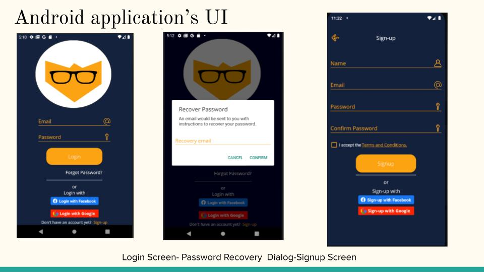

# Inovision_Android_App (Home Security system)

* Developed an Android application for monitoring sensor and camera activity.
* This is the user facing interface that connects the user to the Pi 4 Microcontroller. 
* Firebase used for Email/Password, Facebook and Google Authentication
* Implementation of client side indexing for the sorting and filtering of Facial Rec data and Sensor activity 

